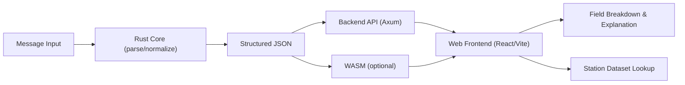

# Aviation WX Decoder


[English](README.md) | [中文](README.zh-CN.md)

A Rust 2021 workspace for decoding aviation weather messages. It parses TAF, METAR, and NOTAM, normalizes key fields, and produces structured JSON. The frontend renders multilingual explanations from the JSON and provides message analysis.

It ships as:

- A reusable Rust library (`crates/aviation-wx`) with `parse_*`, `normalize_*`, `translate_*`, and `decode_message` APIs.
- A backend HTTP service (`crates/backend`).
- A React/Vite frontend (`web`) with field breakdown, explanation, and station lookup.

## Architecture



## Workspace Layout

- `crates/core`: shared models, enums, helpers, and normalization utilities.
- `crates/taf`: TAF parser + normalizer + translator.
- `crates/metar`: METAR parser + normalizer + translator.
- `crates/notam`: NOTAM parser + normalizer + translator.
- `crates/aviation-wx`: library facade and unified decode API.
- `crates/backend`: HTTP API server.
- `web`: React/Vite frontend.

## Quick Start

### Backend

```bash
cargo run -p backend
```

The service listens on `http://127.0.0.1:17643` by default.

OpenAPI file: `docs/openapi.json`.

Environment variables:

- `BACKEND_HOST` / `BACKEND_PORT` for the backend server.

### Backend Smoke Test

```bash
powershell -ExecutionPolicy Bypass -File scripts/smoke.ps1
```

Optional args:

- `-BackendUrl http://127.0.0.1:17643`
- `-File tests/fixtures/metar/001.txt`
- `-Message "METAR ..."`
- `-BatchDir tests/fixtures/metar -Pattern *.txt`

### Web Frontend

```bash
cd web
npm install
npm run dev
```

Build output:

```bash
npm run build
```

Environment variables (Vite):

- `VITE_API_BASE_URL` (default: `http://127.0.0.1:17643`)
- `VITE_AIRPORTS_URL` (optional, see Station Dataset)
- `VITE_USE_WASM` (optional, set `true` to decode locally with WASM)

See `web/.env.example` for a template.

Chinese documentation: `README.zh-CN.md`.

## Station Dataset (OSM/ODbL)

The frontend can resolve ICAO station codes to airport names. Data is generated from OpenStreetMap (ODbL) and published as a static JSON file via GitHub Releases.

Dataset repository: `https://github.com/Nishikori-Yui/aviation-airport-dataset`  
Latest release asset: `https://github.com/Nishikori-Yui/aviation-airport-dataset/releases/latest/download/airports.json`

Expected JSON shape:

```json
{
  "meta": {
    "dataset_version": "2026-02-01",
    "generated_at": "2026-02-01T12:00:00Z",
    "source": "OpenStreetMap contributors"
  },
  "airports": {
    "ZBAA": {
      "icao": "ZBAA",
      "iata": "PEK",
      "name": "北京首都国际机场",
      "name_en": "Beijing Capital International Airport",
      "name_local": "北京首都国际机场",
      "local_lang": "zh",
      "country": "CN",
      "city": "Beijing",
      "lat": 40.0801,
      "lon": 116.5846
    }
  }
}
```

If `VITE_AIRPORTS_URL` is not set, the UI will still work but will not show airport names.

Local override:

- Place a file at `web/public/data/airports.json`.
- The frontend will use the local file first and skip remote fetching if it exists.

## Static Deployment

The frontend is a static Vite app and can be deployed to providers such as Cloudflare Pages, GitHub Pages, or Vercel. Set `VITE_API_BASE_URL` and `VITE_AIRPORTS_URL` at build time to point to your backend and dataset.

### GitHub Pages

The workflow `.github/workflows/pages.yml` builds `web` and deploys to GitHub Pages.

Before enabling Pages:

1. In GitHub repo settings, enable Pages and select **GitHub Actions** as the source.
2. Update `VITE_API_BASE_URL` in the workflow to your backend URL.
3. If your repo name changes, update `VITE_BASE` in the workflow.

## WASM mode

The frontend can decode locally via WASM. See `docs/wasm.md` for build steps.

### ODbL Attribution

Station data derived from OpenStreetMap contributors (ODbL). The UI and documentation must include attribution and a link to the derived dataset download location (GitHub Releases).

## API Examples

### TAF

```bash
curl -s -X POST http://127.0.0.1:17643/v1/decode \
  -H 'Content-Type: application/json' \
  -d '{"message":"TAF ZBAA 011130Z 0112/0218 06005MPS 9999 FEW020 SCT040","type":"taf","output":{"json":true,"explain":true},"lang":"zh-CN","detail":"normal"}'
```

Example response snippet:

```json
{
  "schema_version": "1.0",
  "type": "taf",
  "detected_type": "taf",
  "explain": "台站 ZBAA，发布于 01 日 11:30Z，有效期 01 日 12Z - 02 日 18Z，风 060° 10kt，能见度 10km or more，云 FEW 2000ft, SCT 4000ft"
}
```

### METAR

```bash
curl -s -X POST http://127.0.0.1:17643/v1/decode \
  -H 'Content-Type: application/json' \
  -d '{"message":"METAR RJTT 011200Z VRB03KT CAVOK 15/10 Q1017","type":"metar","output":{"json":true,"explain":true},"lang":"zh-CN","detail":"normal"}'
```

Example response snippet:

```json
{
  "schema_version": "1.0",
  "type": "metar",
  "detected_type": "metar",
  "explain": "台站 RJTT，发布于 01 日 12:00Z，风 VRB 3kt，能见度 10km or more，气温 15°C 露点 10°C，气压（QNH）≈ 1017.0 hPa"
}
```

### NOTAM

```bash
curl -s -X POST http://127.0.0.1:17643/v1/decode \
  -H 'Content-Type: application/json' \
  -d '{"message":"A1234/24 NOTAMN Q) ZSHA/QMRLC/IV/NBO/A/000/999/3112N12130E005 A) ZSPD B) 2402010000 C) 2402012359 E) RWY 17L/35R CLSD","type":"notam","output":{"json":true,"explain":true},"lang":"zh-CN","detail":"normal"}'
```

Example response snippet:

```json
{
  "schema_version": "1.0",
  "type": "notam",
  "detected_type": "notam",
  "explain": "地点 ZSPD，生效 2402010000，终止 2402012359，内容 RWY 17L/35R CLSD"
}
```

Notes:
- The frontend maintains a growing glossary for common NOTAM body abbreviations (e.g. AD, RWY, CLSD) and will continue expanding coverage.
- Q-code decoding uses FAA Appendix B tables; the project will keep extending dictionary coverage.
- FIR code-to-name mapping can be added via `web/src/data/fir_codes.json` (optional, lightweight).

## CLI (aviation-wx)

Install locally:

```bash
cargo install --path crates/aviation-wx
```

Examples:

```bash
aviation-wx --type metar "METAR ZBAA 011200Z 02005MPS 6000 HZ SCT020 BKN050 02/M03 Q1015"
```

Batch file (one message per line):

```bash
aviation-wx --batch tests/fixtures/cli/batch.txt --pretty --out output.json
```

Output modes:

- `--mode with-raw` (default) includes the raw message in JSON.
- `--mode parsed-only` omits the raw message and only returns parsed + normalized data.

The CLI only outputs structured JSON. It does not include `explain` and does not accept `lang`.

More examples: `docs/cli.md`.

## Release Publishing (crates.io)

Publishing is triggered on GitHub Releases. The workflow is defined in `.github/workflows/publish-crate.yml`.

Required secret:

- `CRATES_IO_TOKEN`

## Testing

```bash
cargo test
```

Golden tests live in `crates/aviation-wx/tests/golden.rs` and load fixtures from `tests/fixtures`. If you change parsing or translation logic, update snapshots with:

```bash
INSTA_UPDATE=always cargo test -p aviation-wx
```

## Extending the Decoder

1. Add a new crate (e.g., `crates/sigmet`) with `parse_*`, `normalize_*`, `translate_*`.
2. Add new model types in `crates/core` if needed.
3. Expose new functions via `crates/aviation-wx`.
4. Update detection heuristics in `crates/core`.
5. Add fixtures and snapshots.

See `docs/assumptions.md` for current parsing assumptions and known limitations.
