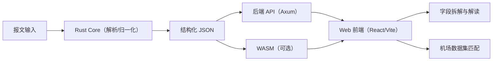

# Aviation WX Decoder（中文说明）


[English](README.md) | [中文](README.zh-CN.md)

这是一个 Rust 2021 workspace，用于解析 TAF / METAR / NOTAM，输出结构化 JSON，并在前端完成多语言解释与报文拆解。

提供：

- 可复用 Rust 库（`crates/aviation-wx`）。
- 后端 HTTP 服务（`crates/backend`）。
- React/Vite 前端（`web`）。
- 前端内置常见 NOTAM 正文缩写词表（如 AD、RWY、CLSD），并会持续补充覆盖范围。
- Q 代码解析使用 FAA Appendix B 词表，并会持续扩充覆盖范围。
- FIR 代码到名称的轻量映射可在 `web/src/data/fir_codes.json` 中维护（可选）。

## Architecture



## 目录结构

- `crates/core`：共享模型、枚举与归一化工具。
- `crates/taf`：TAF 解析与归一化。
- `crates/metar`：METAR 解析与归一化。
- `crates/notam`：NOTAM 解析与归一化。
- `crates/aviation-wx`：统一解码接口。
- `crates/backend`：HTTP API 服务端。
- `web`：React/Vite 前端。

## 快速开始

### 后端

```bash
cargo run -p backend
```

默认监听 `http://127.0.0.1:17643`。

OpenAPI 文件：`docs/openapi.json`。

环境变量：

- `BACKEND_HOST` / `BACKEND_PORT`

### 后端冒烟测试

```bash
curl -s http://127.0.0.1:17643/healthz

curl -s -X POST http://127.0.0.1:17643/v1/decode \
  -H 'Content-Type: application/json' \
  -d '{"message":"METAR RJTT 011200Z VRB03KT CAVOK 15/10 Q1017","type":"metar","output":{"json":true,"explain":true},"lang":"zh-CN","detail":"normal"}'
```

Linux/macOS 下如需用 fixtures 做回归，请直接运行：

```bash
cargo test -p backend --tests
```

### Web 前端

```bash
cd web
npm install
npm run dev
```

构建：

```bash
npm run build
```

Vite 环境变量：

- `VITE_API_BASE_URL`（默认 `http://127.0.0.1:17643`）
- `VITE_AIRPORTS_URL`（可选，见机场数据集）
- `VITE_USE_WASM`（可选，设置为 `true` 则前端使用 WASM 本地解码）

模板见 `web/.env.example`。

### 平台运行说明（macOS / Linux Bash）

除特别说明外，命令都在仓库根目录执行。

环境依赖：

- Rust 稳定版工具链（`rustup`、`cargo`）
- Node.js 20+ 与 npm
- 可选：`wasm-pack`（WASM 模式）

后端启动：

```bash
cargo run -p backend
```

前端启动：

```bash
cd web
npm install
npm run dev
```

WASM 构建：

```bash
cargo install wasm-pack
wasm-pack build crates/aviation-wx-wasm --target web --out-dir ../../web/public/wasm
```

测试：

```bash
cargo test
```

后端冒烟测试脚本：

- 建议手动用 `curl` 验证接口，或直接运行：

```bash
cargo test -p backend --tests
```

## 机场数据集（OSM/ODbL）

前端可将 ICAO 站点码映射为机场名称。数据来源于 OpenStreetMap（ODbL），预生成后发布到 GitHub Releases。

数据集仓库：`https://github.com/Nishikori-Yui/aviation-airport-dataset`  
最新 Release 资源：`https://github.com/Nishikori-Yui/aviation-airport-dataset/releases/latest/download/airports.json`

期望的 JSON 结构：

```json
{
  "meta": {
    "dataset_version": "2026-02-01",
    "generated_at": "2026-02-01T12:00:00Z",
    "source": "OpenStreetMap contributors"
  },
  "airports": {
    "ZBAA": {
      "icao": "ZBAA",
      "iata": "PEK",
      "name": "北京首都国际机场",
      "name_en": "Beijing Capital International Airport",
      "name_local": "北京首都国际机场",
      "local_lang": "zh",
      "country": "CN",
      "city": "Beijing",
      "lat": 40.0801,
      "lon": 116.5846
    }
  }
}
```

如果未配置 `VITE_AIRPORTS_URL`，前端仍可使用，但不会显示机场名称。

本地覆盖：

- 将文件放在 `web/public/data/airports.json`
- 前端会优先使用本地文件，检测到后不会再拉取远程

## 静态部署

前端是纯静态 Vite 应用，可部署在 Cloudflare Pages、GitHub Pages、Vercel 等。构建时配置 `VITE_API_BASE_URL` 和 `VITE_AIRPORTS_URL` 指向后端与数据集。

### GitHub Pages

仓库内置 `.github/workflows/pages.yml`，会自动构建 `web` 并发布到 GitHub Pages。

启用 Pages 前请确认：

1. 在仓库设置中开启 Pages，Source 选择 **GitHub Actions**。
2. 将 workflow 里的 `VITE_API_BASE_URL` 改为你的后端地址。
3. 如果仓库名变更，请同步更新 `VITE_BASE`。

## WASM 模式

前端可通过 WASM 在本地解码。构建说明见 `docs/wasm.md`。

## 文档索引

英文与中文文档按同名配对维护：

- `docs/api.md` / `docs/api.zh-CN.md`
- `docs/assumptions.md` / `docs/assumptions.zh-CN.md`
- `docs/cli.md` / `docs/cli.zh-CN.md`
- `docs/metar_coverage.md` / `docs/metar_coverage.zh-CN.md`
- `docs/schema.md` / `docs/schema.zh-CN.md`
- `docs/wasm.md` / `docs/wasm.zh-CN.md`

### ODbL 署名

机场数据来自 OpenStreetMap contributors（ODbL）。需要在 UI 和文档中标注来源，并提供派生数据的下载地址（GitHub Releases）。

## CLI（aviation-wx）

本地安装：

```bash
cargo install --path crates/aviation-wx
```

示例：

```bash
aviation-wx --type metar "METAR ZBAA 011200Z 02005MPS 6000 HZ SCT020 BKN050 02/M03 Q1015"
```

批处理（每行一条报文）：

```bash
aviation-wx --batch tests/fixtures/cli/batch.txt --pretty --out output.json
```

输出模式：

- `--mode with-raw`（默认）：输出包含原报文
- `--mode parsed-only`：仅输出解析与归一化结果

CLI 仅输出结构化 JSON，不包含 `explain`，也不需要 `lang`。

更多示例见：`docs/cli.md`。

## 发布到 crates.io

发布在 GitHub Releases 时触发，工作流文件：`.github/workflows/publish-crate.yml`。

需要在 GitHub Secrets 中配置：

- `CRATES_IO_TOKEN`

## 测试

```bash
cargo test
```

Goldens 见 `crates/aviation-wx/tests/golden.rs`，fixtures 在 `tests/fixtures`。若修改解析逻辑，请运行：

```bash
INSTA_UPDATE=always cargo test -p aviation-wx
```

## 常见问题

- 端口被占用：
  - 通过 `BACKEND_PORT` 修改端口，例如 `BACKEND_PORT=17644 cargo run -p backend`。
- 前端提示找不到 WASM：
  - 重新构建到 `web/public/wasm`，并确认 `.js` 与 `.wasm` 产物都存在。
- 明明是合法报文却识别成 `unknown`：
  - 先确认输入没有损坏；`decode_message` 已处理 UTF-8 BOM 前缀。
- 跨机器结果不一致：
  - 运行 `cargo clean && cargo test`，并确认 Rust/Node 主版本一致。

## 文档同步规则

修改任意英文 Markdown 文档时，必须在同一次变更中同步更新对应的 `*.zh-CN.md`。
新增 Markdown 文档时，默认同时提供中英文两个版本。

校验脚本：

- macOS / Linux：`bash scripts/check-doc-i18n.sh`

## 扩展指南

1. 新增 crate（如 `crates/sigmet`），实现 `parse_*` / `normalize_*` / `translate_*`。
2. 需要时扩展 `crates/core` 的模型。
3. 在 `crates/aviation-wx` 对外暴露。
4. 更新 `crates/core` 的类型识别逻辑。
5. 增加 fixtures 与 snapshots。
